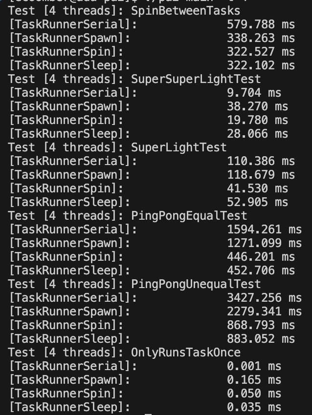

## Getting Started

At a minimum you will need CMake and a C++ compiler that supports C++17. CMake will test for other prerequisites.

## Building

Change directories to the parallel folder and if it is your first time opening, type cmake3 to compile the make files.

```
cmake3 .
```

After executing this command once, you simply need to type the command 

```
make
```

to compile after further changes.

## Explanation of approach
### TaskRunnerSerial
This approach simply executes each task sequentially with no parallelization

### TaskRunnerSpawn
Spawns threads as needed and executes a given amount of work. Threads are spawned and killed after each executes the work needed.

### TaskRunnerSpin
Threads are spawned at the beggining and are "spinning" when they are not executing work. This allows them to be easily called and we do not need to waste time spawning a thread each time we need to execute work. However, if there is a minimal amount of work to be done, this is not necessarily the best approach as "spinning" the threads takes considerable time at the beginning and killing them at the end takes time as well.

### TaskRunnerSleep
Similar to spin, threads are spawned at the beginning but instead of spinning when they do not have work to do, they sleep. This makes it easy to call them when necessary and kill them at the end. Instead of taking the time and overhead to spin the threads at the beginning, we do not need to do that and can simply call the threads when needed.


## Test results
By running the command `./pa2-main -t 4`, we are able to view the results of the parallelization. There are a number of tests that were run and we can see how the different strategies compared with each one.

Parallelization results:


See the details in the parallel folder for details about the code.